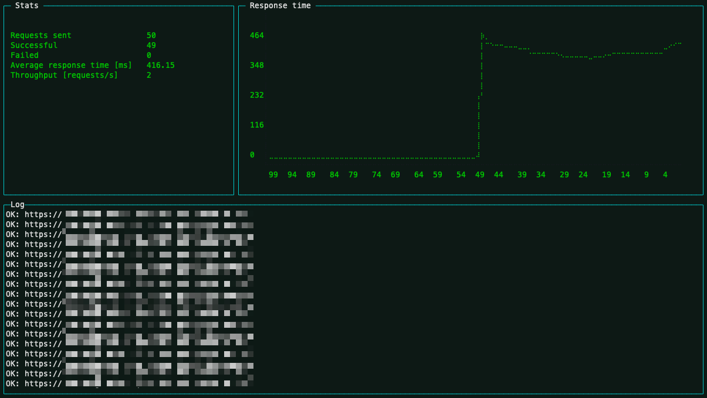

# load-generator

Generates http(s) load.

[](https://www.npmjs.com/package/load-generator)



## Simple usage

Continously calls the URL, with 2 workers.
```bash
npx load-generator http://www.example.com/
```

With 4 workers and with cache buster, `{__random__}` is replaced by a current timestamp.
```bash
npx load-generator --workers 4 http://www.example.com/?random={__random__}
```

Multiple URLs with randomized language value.
```bash
npx load-generator --values lang=de,en,it,fr http://www.example.com/{lang}/ http://www.example.com/{lang}/category/2/?random={__random__}
```

## CLI options

Option | Type | Default | Description
:---|:---|:---|:----
**`--url`** | `string[]` | - | URLs containing optional placeholders. A placeholder must be in curly braces and will be filled with the corresponding values in the named values option. **Default option** This is the default option, the option `--url` may be ommitted for simplicity.
**`--values`** | `string[]` | - | Named value lists for placeholders in the URLs. Must follow the following name and comma-separated pattern: `--values "name=value1,value2,value3"`
**`--header`** | `string[]` | - | HTTP header added to every request. Example to add cookies: `--header "name1=value1; name2:value2"`
**`-p`**, **`--porcelain`** | `boolean` | `false` | Output in machine friendly format, no UI.
**`--pause`** | `int` | `0` | Pause between each request per worker in millisecons.
**`--timeout`** | `int` | `3000` | Request timeout in milliseconds, set to 0 to use system default.
**`-h`**, **`--help`** | - | - | Displays help text.
**`-v`**, **`--version`** | - | - | Displays version.

## Usage with config file
**1.)** Create a configuration file, and save it as `load-generator.json`

In this example, each of the 8 worker picks one URL at the time, fills in placeholders randomly within it's list of values and calls it, one at the time and pauses 100ms in between calls.

```json
{
  "pause": 100,
  "workers": 8,
  "timeout": 1000,
  "urls": [
    "http://www.example.com/{lang}/",
    "http://www.example.com/{lang}/?sort={sort}&page={page}&cachebust={__random__}"
  ],
  "values": {
    "lang": ["de", "fr", "it", "en"],
    "sort": ["1", "2", "3", "4", "5", "7", "8", "10"],
    "page": ["1", "2", "3", "4", "5", "7", "8", "10"]
  },
  "headers": {
    "cookie": "accessToken=1234abc; userId=1234"
  }
}
```

**2.)** Run `npx load-generator` in the same directory.

Hint: Config file and CLI options can be combined, where CLI options always have higher priority over eqivalent config file options.
