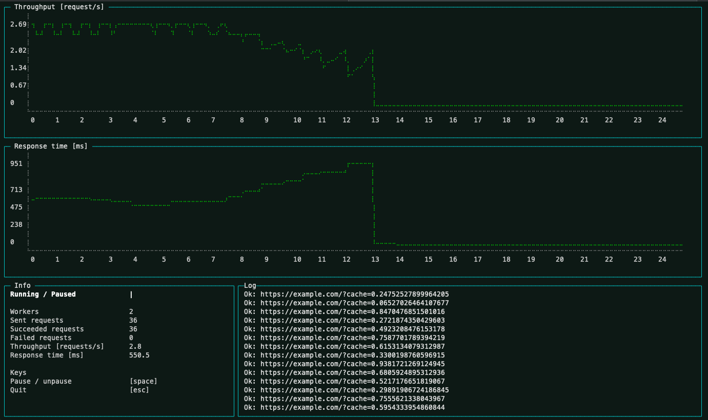

# load-generator

## Usage

<details><summary>

**1.)** Create a configuration file, and save it as `load-generator.json`

</summary>

```json
{
  "wait": 500,
  "workers": 2,
  "urls": [
    "http://www.example.com/{lang}/",
    "http://www.example.com/{lang}/?sort={sort}&page={page}"
  ],
  "values": {
    "lang": ["de", "fr", "it", "en"],
    "sort": ["1", "2", "3", "4", "5", "7", "8", "10"],
    "page": ["1", "2", "3", "4", "5", "7", "8", "10"]
  },
  "fetchOptions": {
    "method": "POST",
    "headers": {
      "cookie": "accessToken=1234abc; userId=1234"
    }
  }
}
```

One url is picked randomly and all placeholders are replaced by values from the value object.

</details>

**2.)** Run `npx load-generator` in the same directory to start generating load.

**3.)** Hit ESC to stop the load

## Screenshot


